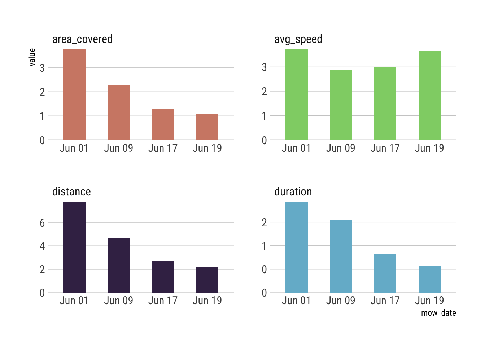

[](https://travis-ci.org/hrbrmstr/deere)
[](https://codecov.io/gh/hrbrmstr/deere)
[](https://cran.r-project.org/package=deere)

# deere

Catchall Functions for All Things ‘John Deere’

## Description

Initially a convenience package to access ‘John Deere’ ‘MowerPlus’
databases from ‘iOS’ backups but perpaps will be something more
all-encompassing.

Ref:

  - <https://rud.is/b/2019/06/02/trawling-through-ios-backups-for-treasure-a-k-a-how-to-fish-for-target-files-in-ios-backups-with-r/>
  - <https://rud.is/b/2019/06/09/wrapping-up-exploration-of-john-deeres-mowerplus-database/>

## What’s Inside The Tin

The following functions are implemented:

  - `from_coredata_ts`: Convert timestampes from Apple “CoreData” format
    to something usable
  - `list_ios_backups`: List iOS backups available on this system
  - `platform_ios_backup_dir`: List iOS backups available on this system
  - `src_mowerplus`: Find and sync a copy of the latest MowerPlus
    database file from an iOS backup

## Installation

``` r
devtools::install_git("https://git.sr.ht/~hrbrmstr/deere.git")
# or
devtools::install_git("https://git.rud.is/hrbrmstr/deere.git")
# or
devtools::install_gitlab("hrbrmstr/deere")
# or
devtools::install_bitbucket("hrbrmstr/deere")
# or
devtools::install_github("hrbrmstr/deere")
```

## Usage

``` r
library(deere)
library(hrbrthemes)
library(tidyverse)

# current version
packageVersion("deere")
## [1] '0.2.0'
```

### Sample from the latest mow

``` r
list_ios_backups()
## # A tibble: 2 x 3
##   path                                              modification_time          size
##   <chr>                                             <dttm>              <fs::bytes>
## 1 28500cd31b9580aaf5815c695ebd3ea5f7455628          2019-06-19 14:31:41       8.19K
## 2 28500cd31b9580aaf5815c695ebd3ea5f7455628-20190601 2019-06-01 17:23:05       8.22K

mow_db <- src_mowerplus()

mow_db
## src:  sqlite 3.22.0 [/Users/hrbrmstr/Data/mowtrack.sqlite]
## tbls: Z_METADATA, Z_MODELCACHE, Z_PRIMARYKEY, ZACTIVITY, ZDEALER, ZMOWALERT, ZMOWER, ZMOWLOCATION, ZSMARTCONNECTOR,
##   ZUSER

glimpse(tbl(mow_db, "ZMOWER"))
## Observations: ??
## Variables: 23
## Database: sqlite 3.22.0 [/Users/hrbrmstr/Data/mowtrack.sqlite]
## $ Z_PK                      <int> 1
## $ Z_ENT                     <int> 7
## $ Z_OPT                     <int> 15
## $ ZDECKSIZEINCHES           <int> 48
## $ ZDISMISSEDFULLSERVICETASK <int> 0
## $ ZDISMISSEDPERIODICTASK    <int> 0
## $ ZSMARTCONNECTOR           <int> NA
## $ ZUSER                     <int> 1
## $ ZBATTERYCHARGE            <dbl> NA
## $ ZENGINEHOURS              <dbl> 4.854714
## $ ZFULLSERVICEPERFORMED     <dbl> NA
## $ ZHMCLASTSEEN              <dbl> NA
## $ ZHMCOFFSET                <dbl> 0
## $ ZPERIODICSERVICEPERFORMED <dbl> NA
## $ ZSCLASTCONNECTED          <dbl> NA
## $ ZGENERICTYPE              <chr> NA
## $ ZHMCIDENTIFIER            <chr> NA
## $ ZMODEL                    <chr> "E140"
## $ ZSCPIN                    <chr> NA
## $ ZSCPERIPHERALID           <chr> NA
## $ ZSERIALNUMBER             <chr> "1GXE140EKKK116940"
## $ ZSERIES                   <chr> "E100"
## $ ZSCDATADICTIONARY         <blob> <NA>

glimpse(tbl(mow_db, "ZACTIVITY"))
## Observations: ??
## Variables: 20
## Database: sqlite 3.22.0 [/Users/hrbrmstr/Data/mowtrack.sqlite]
## $ Z_PK           <int> 1, 2, 3, 4
## $ Z_ENT          <int> 3, 3, 3, 3
## $ Z_OPT          <int> 124, 93, 52, 36
## $ ZMONTH         <int> 6, 6, 6, 6
## $ ZYEAR          <int> 2019, 2019, 2019, 2019
## $ ZMOWER         <int> 1, 1, 1, 1
## $ ZUSER          <int> 1, 1, 1, 1
## $ ZISCOMPLETE    <int> 1, 1, 1, 1
## $ ZISMISSEDMOW   <int> 0, 0, 0, 0
## $ ZLASTLOCATION  <int> 7016, 12548, 15500, 17514
## $ ZCREATEDAT     <dbl> 581100260, 581778616, 582506930, 582659215
## $ ZENGINEHOURS   <dbl> NA, NA, NA, NA
## $ ZAREACOVERED   <dbl> 3.761875, 2.286811, 1.292296, 1.078715
## $ ZAVERAGESPEED  <dbl> 3.727754, 2.894269, 3.011241, 3.650042
## $ ZDISTANCEMOWED <dbl> 7.758894, 4.716564, 2.665370, 2.224857
## $ ZMOWINGTIME    <dbl> 6960.000, 5548.939, 2933.049, 2034.981
## $ ZNOTES         <chr> "First mow!", NA, NA, NA
## $ ZINTERVALNAME  <chr> NA, NA, NA, NA
## $ ZTYPE          <chr> NA, NA, NA, NA
## $ ZUUID          <blob> blob[238 B], blob[238 B], blob[238 B], blob[238 B]

tbl(mow_db, "ZACTIVITY")%>%
  collect() -> activity

activity %>% 
  select(
    mow_date = ZCREATEDAT, 
    area_covered = ZAREACOVERED, 
    avg_speed = ZAVERAGESPEED, 
    distance = ZDISTANCEMOWED, 
    duration = ZMOWINGTIME
  ) %>% 
  arrange(mow_date) %>% 
  mutate(
    duration = duration / 60 / 60, # hours
    mow_date = format(from_coredata_ts(mow_date), "%b %d"), # factors make better bars
    mow_date = factor(mow_date, levels = unique(mow_date)) # when there are just 2-of-em
  ) %>% 
  gather(measure, value, -mow_date) %>% 
  ggplot(aes(mow_date, value)) +
  geom_col(aes(fill = measure), width = 0.5, show.legend = FALSE) +
  scale_y_comma() +
  scale_fill_ipsum() +
  facet_wrap(~measure, scales = "free") +
  theme_ipsum_rc(grid="Y")
```



``` r

zloc <- tbl(mow_db, "ZMOWLOCATION")


zloc %>% 
  select(
    id = ZSESSION,
    zorder = ZORDER,
    lat = ZLATITUDE,
    lng = ZLONGITUDE,
    speed = ZSPEED,
    ts = ZTIMESTAMP
  ) %>% 
  collect() %>% 
  mutate(
    id = factor(id),
    ts = from_coredata_ts(ts)
  ) -> sessions

ggplot(sessions, aes(id, speed)) +
  ggbeeswarm::geom_quasirandom(
    aes(fill = id), show.legend = FALSE,
    shape = 21, size = 2, color = "white", stroke = 0.75
  ) +
  scale_fill_ipsum() +
  labs(x = "Mowing Session", y = "MPH", title = "Mowing Speed Comparison (mph)") +
  theme_ipsum_rc(grid="Y")
```


``` r

arrange(sessions, ts) %>% 
  ggplot(aes(lng, lat)) +
  geom_path(
    aes(color = id, group = id), show.legend = FALSE,
    size = 1, alpha = 1/2
  ) +
  scale_color_ipsum() +
  coord_quickmap() +
  facet_wrap(~id) +
  labs(title = "Mowing Path Comparison") +
  theme_ipsum_rc(grid="Y") +
  ggthemes::theme_map()
```


## deere Metrics

| Lang | \# Files |  (%) | LoC |  (%) | Blank lines |  (%) | \# Lines |  (%) |
| :--- | -------: | ---: | --: | ---: | ----------: | ---: | -------: | ---: |
| Rmd  |        1 | 0.12 |  75 | 0.53 |          33 | 0.56 |       43 | 0.38 |
| R    |        7 | 0.88 |  67 | 0.47 |          26 | 0.44 |       69 | 0.62 |

## Code of Conduct

Please note that this project is released with a [Contributor Code of
Conduct](CONDUCT.md). By participating in this project you agree to
abide by its terms.
